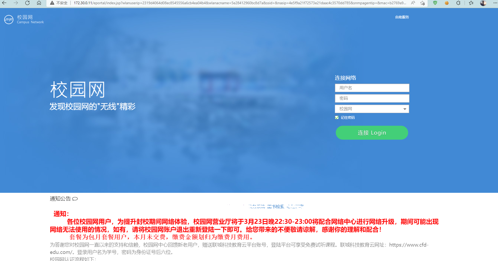

软件介绍
----
- 作用：锐捷校园网自动登录认证
- 因为技术有限，代码写的比较烂
- [视频教程](https://www.bilibili.com/video/BV1aZ4y1m7Jz)

目录结构
----

- conf.py
  - 配置文件
- main.py
  - 校园网登录主程序
- defend.py
  - 校园网守护程序，掉线自动重连
- secure.py
  - 检测当前账号是否已经登录
- toJson.py
  - 将数据转换为json格式

可用性
----

自用一年无任何问题，但是因为每个学校情况有所不同，可能不具有通用性。

自建在香橙派上(OrangePi)，并在香橙派上搭建了V2ray来让多设备同时使用，速度上限取决于香橙派的上限以及你的网络带宽。

理论来讲应该可以通过更改手机和电脑的mac地址做到同时登录，但是我没有试过。

我没有买路由器，所以路由器上跑脚本需要自己调试了。

**我们学校的登录界面**

如何使用
----
1. 安装python，添加到环境变量
2. 安装所需要的库
     - pip install requests

3. 进入src文件夹，更改conf.py的配置文件
4. 运行程序
   - python main.py
